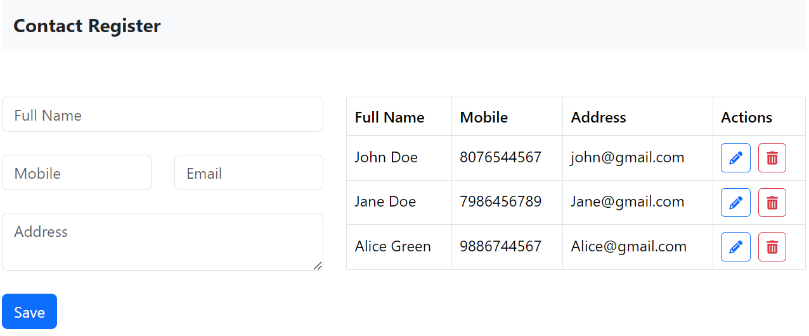

# Contact Register Application

The Contact Register Application is a simple web application built using React and Firebase that allows users to manage their contact details. With this application, users can easily add, update, and delete contact records.

Check out the [Contact Register](https://contact-register.netlify.app/).
